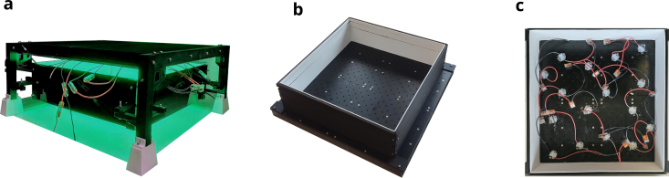
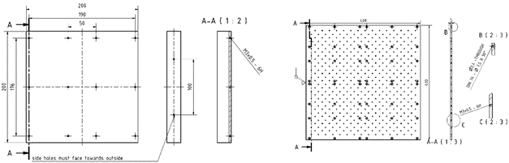
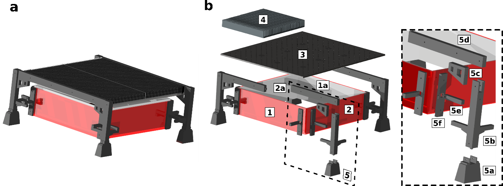
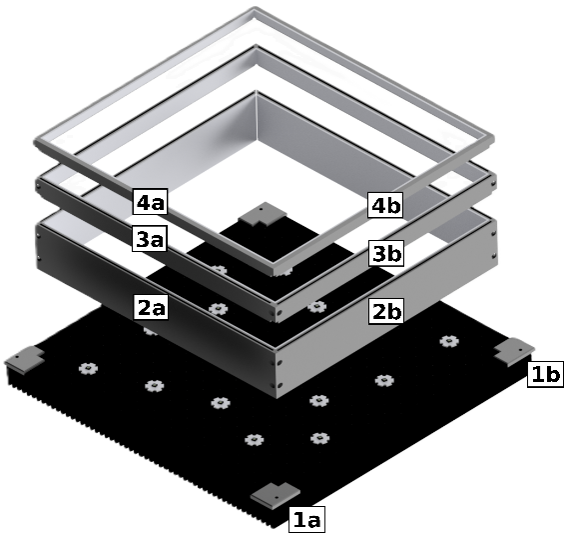

Direct Irradiation Module Assembly
=========================================

Overview
---------

This page describes the mechanical assembly of the direct LED irradiation
module developed in this work, including the heat sink assembly, LED mounting,
and the integration of diffuse reflector modules.

All CAD models of the heat sinks and 3D-printed components are provided in the
modularPhotoreactor GitHub repository [1]_: https://github.com/photonZfeed/modularPhotoreactor

.. _fig-assembly-overview:

  Overview of the assembled direct irradiation module. **a** Fixed height reflector, **b-c** modular reflector with adjustable height.

Heat Sink and LED Mounting
--------------------------

The irradiation module is based on a **400 mm × 400 mm anodized aluminum base
plate**, which serves as both mechanical support and thermal interface for the
LEDs. LEDs are mounted onto the aluminum plate using screws, with a fixed
center-to-center spacing of **25 mm**, resulting in a total of 169 possible LED
mounting positions. To ensure sufficient heat dissipation during operation, the aluminum plate is
mounted onto **four 200 mm × 200 mm finned heat sinks** (RS PRO, 903-3090). A technical drawing of the heat sink assembly is shown in Table 1.

To operate the LEDs, up to 2 × 8 LEDs were connected in series. The LED rows were operated at constant current using two programmable DC power supplies (Korad Lab KA3005P). All required parts are listed in Table 1.

.. _fig-assembly-heatsink:

  Technical drawings of heatsink dimensions and assembly. Four 200 mm x 200 mm aluminum heatsinks  (RS PRO, 903 3090) (left) and the corresponding aluminum LED mounting plate 400 mm x 400 mm with 225 LED mounting positions (right)

.. list-table:: Component list for the heat sink and LED
   :widths: 8 42 25 25
   :header-rows: 1

   * - Nr.
     - Component
     - Material / Reference
     - Repository filename
   * - 1
     - Aluminum LED mounting plate, 400 mm × 400 mm
     - Aluminum, custom made
     - `LED_mount_400x400.stl <https://github.com/photonZfeed/modularPhotoreactor/blob/main/01_CAD/03_Multi_Batch_Screening_Photoreactor/01_Direct_Irradiation_Module/02_heatsink_and%20_LED_mounting_plate/LED_mount_400x400.stl>`_
   * - 2
     - Aluminum heat sink, 200 mm × 200 mm
     - RS PRO, 9033090
     - `heatsink_200.stl <https://github.com/photonZfeed/modularPhotoreactor/blob/main/01_CAD/03_Multi_Batch_Screening_Photoreactor/01_Direct_Irradiation_Module/02_heatsink_and%20_LED_mounting_plate/heatsink_200x200.stl>`_
   * - 3
     - LEDs (e.g. LST1-01G01-UV00-00)
     - —
     - e.g. Mouser Electronics
   * - 4
     - Screws for LED mounting (M3)
     - Stainless steel
     - Standard
   * - 5
     - Power supplies (KA3005P)
     - —
     - Korad Lab
  
Reflector Modules
-------------------

In this work, two different reflector modules were developed to provide diffuse
reflectance around the LED irradiation area: a reflector with fixed height and a 
modular reflector with adjustable height (:numref:`fig-assembly-overview`).
In both cases, the reflector panels were manufactured from **self-adhesive optical PTFE
sheets** (OPF200.XXX.300-U-K, BERGHOF Fluoroplastics) with a thickness of 2 mm,
providing high diffuse reflectivity in the UV and visible spectral range.

Reflector with Fixed Height
^^^^^^^^^^^^^^^^^^^^^^^^^^^^^^

The fixed-height reflector module was developed for operation as an extension
of the multi-batch screening photoreactor on a roller shaker
(IKA Roller Shaker 10 Digital).

The reflector consists of four vertical walls manufactured from red Plexiglass and lined with **2 mm PTFE sheets** on the inner surfaces.:

- Two walls with a length of **330 mm**
- Two walls with a length of **350 mm**
- Uniform wall height of **100 mm**

The walls are manufactured from red Plexiglass and lined with **2 mm PTFE
sheets** on the inner surfaces.

  **a** Assembly of reflector with fixed height and **b** mounting scheme and components of direct irradiation module

A **25 mm vertical gap** between the reflector walls and the heat sink ensures
sufficient airflow for convective cooling.

Table 2 lists all components required for assembling the fixed-height reflector
module, including references to the corresponding CAD files in the
`modularPhotoreactor repository <https://github.com/photonZfeed/modularPhotoreactor>`_

.. list-table:: Component list for the fixed-height reflector module
   :widths: 8 42 25 25
   :header-rows: 1
   
   * - Nr.
     - Component
     - Material / Reference
     - Repository filename
   * - 1
     - PTFE reflector support, 350 mm × 100 mm
     - PMMA (red Plexiglass)
     - —
   * - 1a
     - PTFE reflector lining, 350 mm × 100 mm
     - OPF200.XXX.300-U-K, BERGHOF Fluoroplastics
     - —
   * - 2
     - PTFE reflector support, 330 mm × 100 mm
     - PMMA (red Plexiglass)
     - —
   * - 2a
     - PTFE reflector lining, 330 mm × 100 mm
     - OPF200.XXX.300-U-K, BERGHOF Fluoroplastics
     - —
   * - 3
     - 3D-printed reflector and heat sink holder (assembly)
     - ABS
     - `reflector_fixed_height_assembly.stl <https://github.com/photonZfeed/modularPhotoreactor/blob/main/01_CAD/03_Multi_Batch_Screening_Photoreactor/01_Direct_Irradiation_Module/00_reflector_fixed_height/reflector_fixed_height_assembly.stl>`_
   * - 5a
     - Holder feet
     - ABS
     - `holder_feet_assembly.stl <https://github.com/photonZfeed/modularPhotoreactor/blob/main/01_CAD/03_Multi_Batch_Screening_Photoreactor/01_Direct_Irradiation_Module/00_reflector_fixed_height/holder_feet_assembly.stl>`_
   * - 5b
     - Corner pillars
     - ABS
     - `corner_pillar_1.stl <https://github.com/photonZfeed/modularPhotoreactor/blob/main/01_CAD/03_Multi_Batch_Screening_Photoreactor/01_Direct_Irradiation_Module/00_reflector_fixed_height/corner_pillar_1.stl>`_
       `corner_pillar_2.stl <https://github.com/photonZfeed/modularPhotoreactor/blob/main/01_CAD/03_Multi_Batch_Screening_Photoreactor/01_Direct_Irradiation_Module/00_reflector_fixed_height/corner_pillar_2.stl>`_
       `corner_pillar_3.stl <https://github.com/photonZfeed/modularPhotoreactor/blob/main/01_CAD/03_Multi_Batch_Screening_Photoreactor/01_Direct_Irradiation_Module/00_reflector_fixed_height/corner_pillar_3.stl>`_
       `corner_pillar_4.stl <https://github.com/photonZfeed/modularPhotoreactor/blob/main/01_CAD/03_Multi_Batch_Screening_Photoreactor/01_Direct_Irradiation_Module/00_reflector_fixed_height/corner_pillar_4.stl>`_
   * - 5c
     - Corner pillar support
     - ABS
     - `corner_pillar_support.stl <https://github.com/photonZfeed/modularPhotoreactor/blob/main/01_CAD/03_Multi_Batch_Screening_Photoreactor/01_Direct_Irradiation_Module/00_reflector_fixed_height/corner_pillar_support.stl>`_
   * - 5d
     - Heat sink holder (male / female)
     - ABS
     - `heatsink_holder_male.stl <https://github.com/photonZfeed/modularPhotoreactor/blob/main/01_CAD/03_Multi_Batch_Screening_Photoreactor/01_Direct_Irradiation_Module/00_reflector_fixed_height/heatsink_holder_male.stl>`_
       `heatsink_holder_female.stl <https://github.com/photonZfeed/modularPhotoreactor/blob/main/01_CAD/03_Multi_Batch_Screening_Photoreactor/01_Direct_Irradiation_Module/00_reflector_fixed_height/heatsink_holder_female.stl>`_
   * - 5e
     - Reflector holder
     - ABS
     - `reflector_holder.stl <https://github.com/photonZfeed/modularPhotoreactor/blob/main/01_CAD/03_Multi_Batch_Screening_Photoreactor/01_Direct_Irradiation_Module/00_reflector_fixed_height/reflector_holder.stl>`_
   * - 5f
     - Corner pillar connector (330 mm / 350 mm)
     - ABS
     - `corner_pillar_connector_330mm.stl <https://github.com/photonZfeed/modularPhotoreactor/blob/main/01_CAD/03_Multi_Batch_Screening_Photoreactor/01_Direct_Irradiation_Module/00_reflector_fixed_height/corner_pillar_connector_330mm.stl>`_
       `corner_pillar_connector_350mm.stl <https://github.com/photonZfeed/modularPhotoreactor/blob/main/01_CAD/03_Multi_Batch_Screening_Photoreactor/01_Direct_Irradiation_Module/00_reflector_fixed_height/corner_pillar_connector_350mm.stl>`_

Modular Reflector with Adjustable Height
----------------------------------------

For systematic investigation of LED-to-detector distance effects, a modular,
height-adjustable reflector system was developed.

The modular reflector consists of three stackable segments with heights of
60 mm, 20 mm, and 10 mm as illustrated in :numref:`fig-assembly-modular-reflector`. By combining these elements, total reflector heights of
**60 mm, 80 mm, and 90 mm** can be realized. The bill of materials for the modular
reflector system is provided in Table 3.

The reflector modules are placed **directly onto the LED-mounted heat sink**
without clearance. The bottom plane of the reflector in contact with the heat
sink defines the **optical reference plane** for all z-distance definitions.

Reproducible positioning and stacking are ensured by **3D-printed corner
alignment holders**, which prevent lateral displacement during assembly and
operation.

.. _fig-assembly-modular-reflector:

  Overview of the modular reflector components.

.. list-table:: Component list for the fixed-height reflector module
   :widths: 8 42 25 25
   :header-rows: 1
   
   * - Nr.
     - Component
     - Material / Reference
     - Repository filename
   * - 1a
     - Corner reflector holder a 
     - ABS
     - `corner_reflector_holder_1a.stl <https://github.com/photonZfeed/modularPhotoreactor/tree/main/01_CAD/03_Multi_Batch_Screening_Photoreactor/01_Direct_Irradiation_Module/01_modular_reflector_adjustable_height/corner_reflector_holder_1a.stl>`_
   * - 1b
     - Corner reflector holder b 
     - ABS
     - `corner_reflector_holder_1b.stl <https://github.com/photonZfeed/modularPhotoreactor/tree/main/01_CAD/03_Multi_Batch_Screening_Photoreactor/01_Direct_Irradiation_Module/01_modular_reflector_adjustable_height/corner_reflector_holder_1b.stl>`_
   * - 2a
     - Reflector holder 330 mm length, 60 mm height
     - ABS
     - `reflector_holder_330mm_6cm.stl <https://github.com/photonZfeed/modularPhotoreactor/tree/main/01_CAD/03_Multi_Batch_Screening_Photoreactor/01_Direct_Irradiation_Module/01_modular_reflector_adjustable_height/reflector_holder_330mm_6cm.stl>`_
   * - 2b
     - Reflector holder 350 mm length, 60 mm height
     - ABS
     - `reflector_holder_350mm_6cm.stl <https://github.com/photonZfeed/modularPhotoreactor/tree/main/01_CAD/03_Multi_Batch_Screening_Photoreactor/01_Direct_Irradiation_Module/01_modular_reflector_adjustable_height/reflector_holder_350mm_6cm.stl>`_
   * - 3a
     - Reflector holder 330 mm length, 20 mm height
     - ABS
     - `reflector_holder_330mm_2cm.stl <https://github.com/photonZfeed/modularPhotoreactor/tree/main/01_CAD/03_Multi_Batch_Screening_Photoreactor/01_Direct_Irradiation_Module/01_modular_reflector_adjustable_height/reflector_holder_330mm_2cm.stl>`_
   * - 3b
     - Reflector holder 350 mm length, 20 mm height
     - ABS
     - `reflector_holder_350mm_2cm.stl <https://github.com/photonZfeed/modularPhotoreactor/tree/main/01_CAD/03_Multi_Batch_Screening_Photoreactor/01_Direct_Irradiation_Module/01_modular_reflector_adjustable_height/reflector_holder_350mm_2cm.stl>`_
   * - 4a
     - Reflector holder 330 mm length, 10 mm height
     - ABS
     - `reflector_holder_330mm_1cm.stl <https://github.com/photonZfeed/modularPhotoreactor/tree/main/01_CAD/03_Multi_Batch_Screening_Photoreactor/01_Direct_Irradiation_Module/01_modular_reflector_adjustable_height/reflector_holder_330mm_1cm.stl>`_
   * - 4b
     - Reflector holder 350 mm length, 10 mm height
     - ABS
     - `reflector_holder_350mm_1cm.stl <https://github.com/photonZfeed/modularPhotoreactor/tree/main/01_CAD/03_Multi_Batch_Screening_Photoreactor/01_Direct_Irradiation_Module/01_modular_reflector_adjustable_height/reflector_holder_350mm_1cm.stl>`_
   * - 5
     - PTFE reflector lining
     - OPF200.XXX.300-U-K, BERGHOF Fluoroplastics
     - —

.. [1] D. Kowalczyk, P. Li, A. Abbas, J. Eichhorn, P. Buday, M. Heiland, A. Pannwitz, F. H. Schacher, W. Weigand, C. Streb, D. Ziegenbalg, ChemPhotoChem 2022, 6, DOI 10.1002/cptc.202200044.