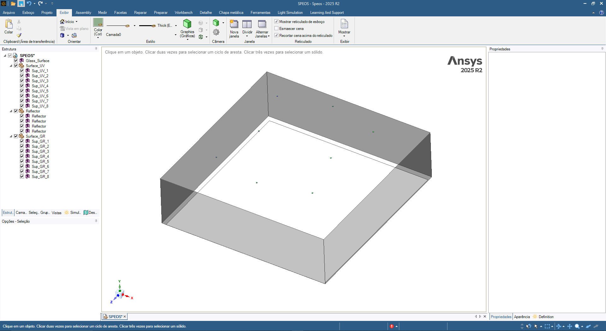
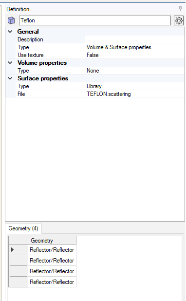
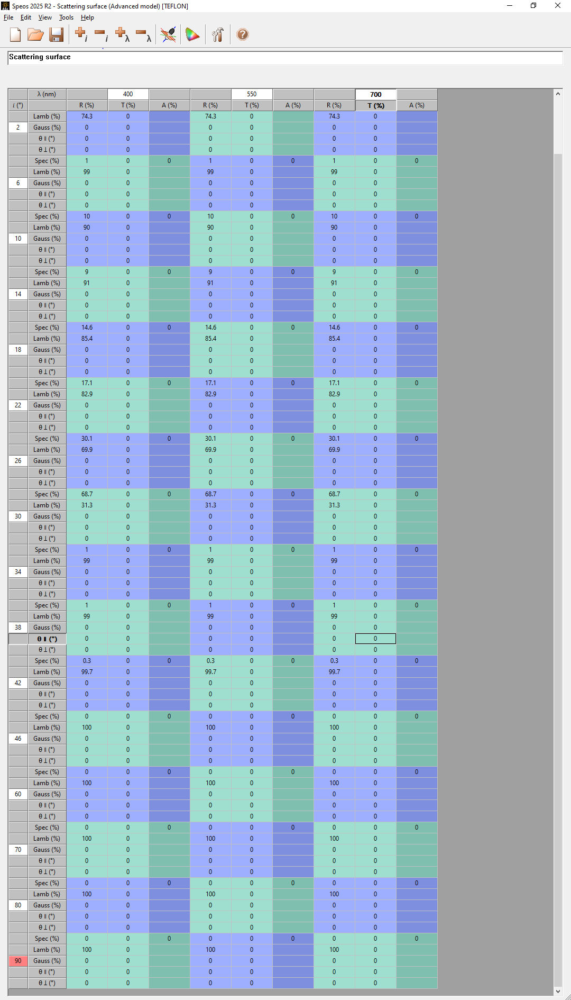
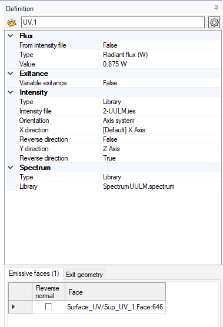
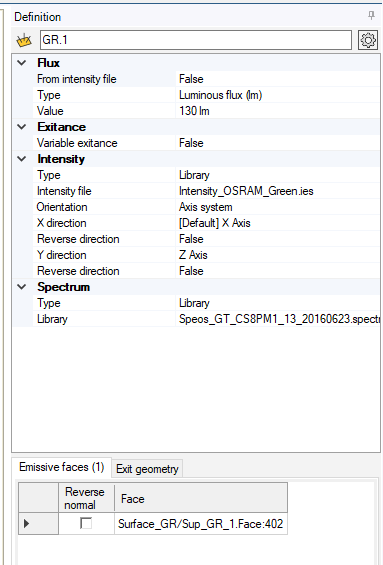
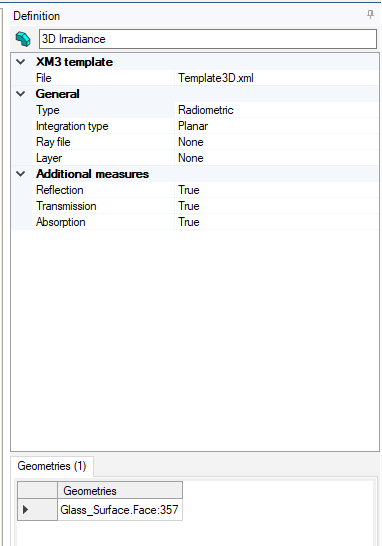
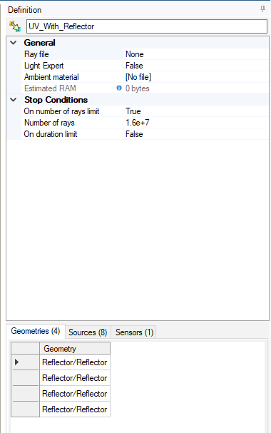
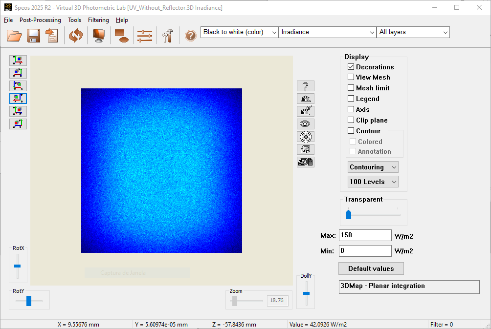

Ray Tracing Simulations
==========================

Overview
---------

Ray tracing simulations were performed to assess the influence of optical
reflectors and detailed light–matter interactions that are not captured by the
geometric radiation field model. All simulations were conducted using the
commercial non-sequential ray tracing software **Ansys Speos 2025 R2**.

Simulation Workflow
-------------------

All ray tracing simulations followed an identical, fully reproducible workflow.

The three-dimensional geometry of the irradiation module—including LED emitting
surfaces and reflector components where applicable — was created directly within
the Speos CAD environment (see :numref:`fig-speos-geometry`).

A global Cartesian coordinate system was used as a reference frame for defining
the geometry, positioning all optical components, and specifying source and
sensor orientations. The surrounding domain was assumed to be homogeneous and
filled with air, modeled as a non-absorbing and non-scattering medium with a
refractive index of 1.0.

Geometry Definition
-------------------

The emitting surfaces of the LEDs were defined as planar surfaces lying in the
*xz*-plane. The primary optical axis of the system was aligned with the positive
*y*-direction. The sensor plane was positioned parallel to the *xz*-plane at
*y = 0* and served as the reference plane for irradiance evaluation.

All relative positions and orientations of LEDs, reflectors, and the detection
plane were explicitly defined within this coordinate system for each simulated
configuration.

.. _fig-speos-geometry:

   Geometry definition of the irradiation module in Ansys Speos.

Material Definition
-------------------

The surrounding environment was modeled as air with a refractive index of 1.0.
Reflector surfaces were defined as purely reflective materials with mixed
Lambertian–specular behavior that varies with the incident angle.

The angle-dependent reflection characteristics were implemented following the
optical properties reported by Janecek and Moses [1]_ (see :numref:`fig-speos-material` and :numref:`fig-speos-teflon`).

.. _fig-speos-material:

   Material definition of optical components in Ansys Speos.

.. _fig-speos-teflon:

   Angle-dependent Lambertian and specular scattering properties applied to the
   PTFE reflector material.

Surface Source Definition
-------------------------

Surface sources were created to represent both UV and green LEDs. For each LED
type, the following parameters were specified:

Emitting surface area  
  * Green LED: diameter = 2.15 mm  
  * UV LED: diameter = 2.6 mm
Optical power emitted per LED  
  * Green LED: 0.28 W  
  * UV LED: 0.875 W
Emission spectrum  
  * Green LED: 530 nm peak wavelength with 30 nm full width  
  * UV LED: 365 nm peak wavelength with 5 nm full width
  * Angular light intensity distribution provided by the manufacturer

Separate surface source definitions were used for the UV and green LEDs (see :numref:`fig-speos-uv` and :numref:`fig-speos-green`).

.. _fig-speos-uv:

   Definition of the UV LED surface source in Ansys Speos.

.. _fig-speos-green:

   Definition of the green LED surface source in Ansys Speos.

Sensor Definition
-----------------

Irradiance was quantified using a planar radiance sensor with dimensions
**33 cm × 34 cm**, positioned at several LED-to-sensor distances depending on the
investigated configuration (see :numref:`fig-speos-sensor`).

The sensor surface was discretized using a triangular mesh with a mesh step of
1 mm, resulting in a total of **225,576 nodes**, at which local irradiance values
were computed. Irradiance integration was performed orthogonally to the sensor
plane, accounting for the cosine dependence of irradiance on the angle of
incidence.

.. _fig-speos-sensor:

   Radiance sensor definition and discretization settings in Ansys Speos.

Simulation Settings
-------------------

Ray propagation from the LED sources to the sensor was simulated using a
**Direct Simulation** approach (see :numref:`fig-speos-direct`). Double precision was enabled for the ray tracer
to improve numerical accuracy.

The maximum number of interactions per ray was set to 100, allowing individual
rays to undergo multiple reflections and scattering events before termination.
The stopping criterion for all simulations was defined as a total of
**1.6 × 10⁷ rays**, based on a ray number sensitivity analysis described in the
Supporting Information.

.. _fig-speos-direct:

   Direct simulation settings used for ray tracing in Ansys Speos.

Results Visualization
---------------------

The resulting irradiance distributions were visualized directly within the
Speos post-processing environment using the sensor output (see :numref:`fig-speos-results`). Spatial irradiance
maps served as the basis for calculating mean irradiance and homogeneity metrics
and for comparison with geometric modelling and experimental radiometry.

.. _fig-speos-results:

   Visualization of irradiance distributions on the sensor plane in Ansys Speos.

.. [1] M. Janecek, W. W. Moses, IEEE Trans. Nucl. Sci. 2008, 55, 2443–2449.

